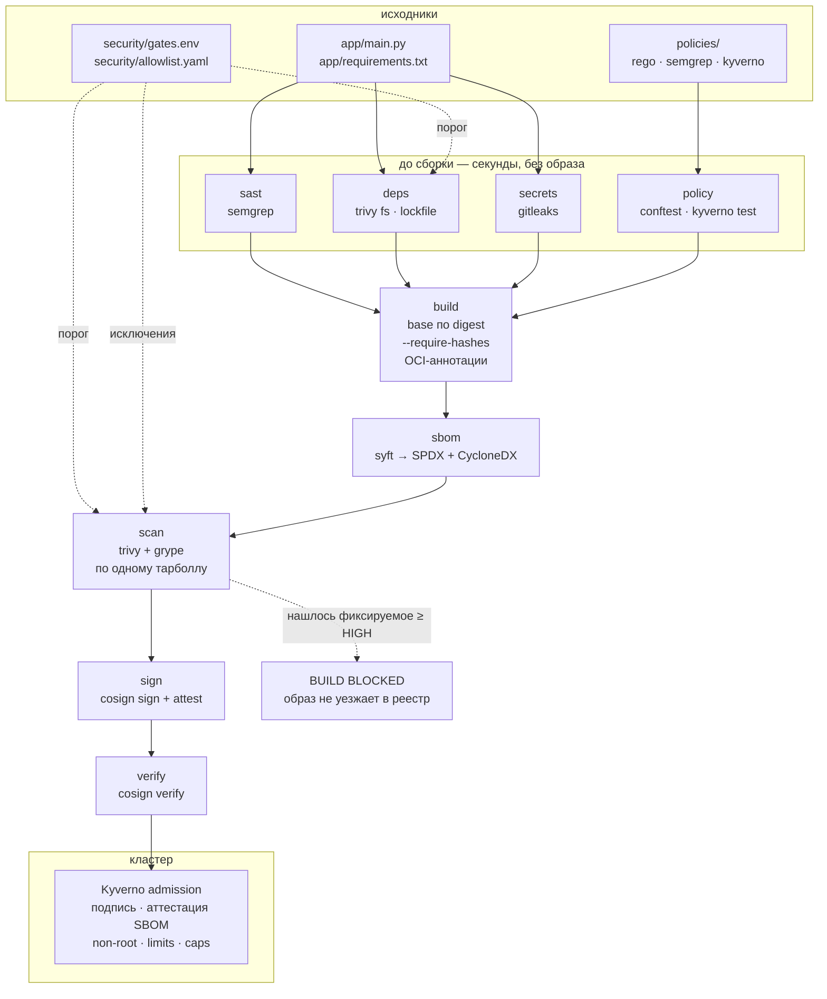

# devsecops-pipeline

Цепочка поставки контейнерного образа, собранная так, чтобы её можно было
запустить целиком на ноутбуке и посмотреть, как она **блокирует релиз**.
Восемь стадий, каждая — отдельный скрипт с собственным кодом возврата, плюс
второй прогон на заведомо дырявом образе, который обязан упасть.

```
make demo-pass   # чистый образ: собран, просканирован, подписан, проверен
make demo-fail   # дырявый образ: три независимых гейта его не пропускают
```

---

## Задача

«У нас в CI стоит Trivy» — это не про безопасность поставки. Это про наличие
Trivy. Разница видна на четырёх типовых местах, где цепочка перестаёт работать,
не подавая признаков:

**Сканер, который никогда ничего не заблокировал, неотличим от сломанного.**
Шаг с `continue-on-error: true` и красивым отчётом в артефактах даёт ровно тот
же зелёный пайплайн, что и шаг, у которого месяц назад протухли креды к базе
уязвимостей. Единственный способ отличить одно от другого — регулярно
предъявлять сканеру заведомо плохой артефакт и требовать, чтобы он упал.
В этом репозитории это отдельный workflow, и он красный, когда гейты **не**
срабатывают.

**Отчёт без порога — это дашборд.** Пока не сказано, что именно останавливает
сборку, решение принимает тот, кто смотрит на список из 400 строк в пятницу
вечером. Здесь порог лежит в одном файле — `security/gates.env` — и его
изменение это отдельный диф на ревью, а не правка внутри скрипта.

**Подпись, которую никто не проверяет, — это метаданные.** `cosign sign` в конце
пайплайна выглядит солидно и не значит ничего, если кластер принимает любой
образ. Поэтому подпись здесь проверяется дважды: сразу после выпуска (иначе
сломавшийся шаг подписи живёт месяцами) и на admission — Kyverno-политикой,
которая требует конкретную OIDC-личность workflow, а не «хоть какую-то подпись».

**Исключение без срока — это выключенный сканер.** Строка в `.trivyignore`
живёт вечно и не помнит, кто её добавил и почему. Здесь исключения описаны в
`security/allowlist.yaml`, валидатор требует владельца, содержательное
обоснование и окно не длиннее 90 дней, а по истечении срока запись просто
перестаёт подавлять находку.

Репозиторий — не туториал по конкретным инструментам. Это рабочий скелет
цепочки: с порогами, с политикой в двух местах, с проверяемыми исключениями и
с доказательством того, что гейты ещё живы.

---

## Архитектура



Разделение на «до сборки» и «после сборки» — не косметика. Первые четыре стадии
не требуют образа и укладываются в секунды: они называют файл, который надо
править. Сборка и всё, что после неё, стоит минуты и отвечает на другой вопрос —
что реально уехало в реестр.

---

## Как это выглядит

### `make demo-pass`

Полный прогон на чистом образе. Реальный вывод (сокращён по вертикали, вывод
сборки вырезан):

```
==> sast: scanning app/ and pipeline/ with semgrep 1.145.0
  0 finding(s) at ERROR severity
  PASS sast: no ERROR-severity findings (report: artifacts/sast.json)

==> deps: scanning app/requirements.txt at HIGH,CRITICAL with trivy 0.74.0
  no clean dependency findings at the gating severity
  PASS deps: app/requirements.txt is clean at HIGH,CRITICAL

==> secrets: gitleaks v8.30.1, mode=worktree
  PASS secrets: no credentials detected in the worktree scan

==> policy: running policy unit tests (conftest v0.69.0)
19 tests, 19 passed, 0 warnings, 0 failures
21 tests, 21 passed, 0 warnings, 0 failures
==> policy: evaluating app/Dockerfile
9 tests, 9 passed, 0 warnings, 0 failures
==> policy: evaluating deploy/k8s
16 tests, 16 passed, 0 warnings, 0 failures
==> policy: confirming the policy still rejects the known-bad manifest
  PASS policy: known-bad manifest correctly rejected
==> policy: validating Kyverno admission policies (kyverno v1.15.2)
Test Summary: 13 tests passed and 0 tests failed

==> build: building devsecops-demo:clean from app/Dockerfile
  source   https://github.com/lpogosu/devsecops-pipeline
  base.name      docker.io/library/python:3.13-slim
  PASS build: devsecops-demo:clean built (sha256:d14d0817…), exported to artifacts/clean.tar

==> sbom: cataloguing artifacts/clean.tar with syft v1.51.1
  SPDX SPDX-2.3: 108 packages
  CycloneDX 1.7: 1 application, 2688 file, 106 library, 1 operating-system
  packages with no declared licence: 2/108

==> scan: compiling accepted findings from security/allowlist.yaml
allowlist: 1 entries, 1 active, 0 lapsed
  active  CVE-2025-15367     scope=image   owner=lpogosu    expires=2026-12-06 (90d left)
==> scan: trivy 0.74.0 on artifacts/clean.tar
==> scan: grype v0.118.0 on artifacts/clean.tar
  trivy 0 | grype 0 | union 0 at >= HIGH (fixable only)
  agreement: 0 shared, 0 trivy-only, 0 grype-only
  PASS scan: no blocking findings at HIGH for the clean image

==> sign: no OIDC token available, signing dsp-registry:5000/devsecops-demo@sha256:d14d0817… with the local demo key
  PASS sign: signed and attested devsecops-demo@sha256:d14d0817…
  PASS sign: signature and SBOM attestation verify for devsecops-demo@sha256:d14d0817…

releasable: scanned, signed, attested and verified
```

### `make demo-fail`

Тот же конвейер на `app/Dockerfile.vulnerable` — Python 3.9 на bullseye, зависимости
без хешей, процесс от root. Каждый гейт останавливает сборку отдельно; цель
считается успешной, только если **все три** сработали.

Гейт зависимостей называет пакет и версию, до которой надо обновиться, а не
вываливает список CVE:

```
==> deps: scanning app/requirements-vulnerable.txt at HIGH,CRITICAL with trivy 0.74.0
  pyyaml 5.3.1
      CRITICAL CVE-2020-14343
      fix: upgrade to 5.4
  urllib3 1.26.5
      HIGH     CVE-2023-43804
      HIGH     CVE-2025-66418
      HIGH     CVE-2025-66471
      HIGH     CVE-2026-21441
      HIGH     CVE-2026-44431
      fix: upgrade to 2.0.6, 1.26.17, 2.6.0, 2.6.3, 2.7.0

  6 finding(s) across 2 package(s)

  BUILD BLOCKED  stage=deps  reason=vulnerable dependencies pinned in app/requirements-vulnerable.txt
```

Политика Dockerfile:

```
==> policy: evaluating app/Dockerfile.vulnerable
WARN - app/Dockerfile.vulnerable - final stage declares no HEALTHCHECK
FAIL - app/Dockerfile.vulnerable - final stage runs as root: add a USER instruction with a non-root uid
FAIL - app/Dockerfile.vulnerable - pip install from a requirements file must pass --require-hashes

9 tests, 6 passed, 1 warning, 2 failures
  BUILD BLOCKED  stage=policy  reason=1 policy check(s) failed
```

Сканирование образа — и заодно самый наглядный аргумент за два сканера:

```
==> scan: trivy 0.74.0 on artifacts/vulnerable.tar
==> scan: grype v0.118.0 on artifacts/vulnerable.tar
  trivy 46 | grype 83 | union 97 at >= HIGH (fixable only)
  agreement: 32 shared, 14 trivy-only, 51 grype-only
  blocking (97):
    CRITICAL GHSA-8q59-q68h-6hv4  pyyaml 5.3.1  [fix 5.4]
    CRITICAL CVE-2026-42010       libgnutls30 3.7.1-5+deb11u7  [fix 3.7.1-5+deb11u10]
    ... 82 more

  BUILD BLOCKED  stage=scan  reason=the image has fixable vulnerabilities at or above HIGH
```

Дырявый образ никуда не пушится, не подписывается и не может пройти admission:
до стадии `sign` дело просто не доходит.

---

## Решения и компромиссы

### Два сканера образа, а не один

Trivy и Grype по-разному сопоставляют установленные пакеты с advisory и тянут
данные частично из разных источников. Обычно это подают как «для надёжности».
Числа выше — из реального прогона на `app/Dockerfile.vulnerable`:

| | находок ≥ HIGH, фиксируемых |
|---|---|
| Trivy | 46 |
| Grype | 83 |
| в обоих | 32 |
| только Trivy | 14 |
| только Grype | 51 |
| объединение | **97** |

То есть каждый из инструментов по отдельности пропускает от 15% до 50%
фиксируемых находок. Расхождение здесь не постулируется в README, а измеряется
на каждом прогоне и печатается: `pipeline/scan_report.py` приводит оба отчёта к
одной форме — `(идентификатор advisory, пакет)` — и считает пересечение.

Что при этом сознательно **не** делается: GHSA-идентификаторы не
отображаются на CVE. Для этого нужна база соответствий, а угадывание слило бы
в одну строку две разные находки. Из-за этого часть «расхождения» —
на самом деле один и тот же дефект под двумя именами, и в таблице выше это
честно остаётся расхождением.

Нормализация всё же есть там, где она проверяема: версии в ключ не входят
(Trivy пишет `3.0.1-1`, Grype `3.0.1` — это не разногласие), а имя пакета
приводится к нижнему регистру (`pyyaml` против `PyYAML`). Обе нормализации
покрыты тестами именно как защита от фиктивных расхождений.

Цена решения — сканирование идёт вдвое дольше и надо поддерживать две
конфигурации исключений. Вторая проблема решена генерацией (см. ниже), первая
приемлема: обе стадии читают **один и тот же экспортированный тарболл**, так
что образ собирается один раз.

### Блокируем по «есть фикс», а не по «есть CVE»

`IGNORE_UNFIXED="true"`. Находка без выпущенного исправления — это то, с чем
команда сервиса не может сделать ничего: обновляться некуда. Блокировать релиз
из-за неё означает поставить разработчика в положение, из которого нет выхода
кроме как отключить гейт целиком, — и он его отключит.

Такие находки не исчезают: они попадают в отчёт каждый прогон и просматриваются
на плановом запуске. Отдельно оговорюсь, что это решение стоит пересматривать
для образов, смотрящих в интернет напрямую: там иногда правильнее остановить
поставку и поискать обходной путь. Здесь — сервис за ingress, и настройка
отражает это.

### Порог HIGH, а не CRITICAL и не MEDIUM

`FAIL_ON_SEVERITY="HIGH,CRITICAL"`.

Только CRITICAL — почти всегда самообман: подавляющее большинство реально
эксплуатируемых цепочек собирается из HIGH. Порог, который пропускает всё,
кроме десятка самых громких CVE в год, даёт ощущение контроля без контроля.

MEDIUM с первого дня — другая крайность. На типовом базовом образе это
сотни находок, из которых значимы единицы; команда за неделю научится
проходить мимо красного пайплайна, и вместе с MEDIUM перестанет замечать
CRITICAL. Понижать порог имеет смысл после того, как поток на текущем стабильно
нулевой.

Важно, что это одно значение в одном файле: и `deps`, и `scan` читают
`security/gates.env`, так что «поднять планку» — это один диф, а не синхронная
правка нескольких скриптов, о которой кто-нибудь забудет.

### Allowlist с обязательным сроком вместо `.trivyignore`

`.trivyignore` — это строка `CVE-2022-40897` без автора, даты и причины.
Через полгода никто не знает, актуальна ли она, и удалить её страшнее, чем
оставить.

Здесь единственный редактируемый человеком файл — `security/allowlist.yaml`, а
`pipeline/allowlist.py` компилирует его в форматы Trivy и Grype перед каждым
сканированием. Валидатор отклоняет запись, если в ней нет владельца-человека,
если обоснование короче 60 символов или совпадает с шаблонной фразой
(«false positive», «not applicable», «accepted risk»), если окно между `granted`
и `expires` больше 90 дней, если дата записана строкой в кавычках (тогда она
молча стала бы строкой и никогда не сравнилась бы правильно).

Ключевая деталь — окно считается от **даты выдачи**, а не «от сегодня». Так
правило проверяемо: валидатор может доказать, что поводок был коротким в момент
выдачи, независимо от того, когда он запускается.

Что происходит по истечении срока: запись просто перестаёт попадать в
сгенерированные конфиги. Находка возвращается, гейт судит её заново по существу,
прогон помечается предупреждением. Ломать сканер вместо этого — плохая идея:
это учит людей выключать сканер. Строгий режим (`validate --strict`, падение на
протухших записях) включён только в плановом еженедельном запуске: ронять чужой
pull request из-за того, что у кого-то ночью истекло исключение, — верный способ
научить команду обходить контроль.

Генерация решает и вторую проблему: исключение физически не может разъехаться
между двумя сканерами, потому что оба конфига рождаются из одной записи.
`scope` при этом ограничивает подавление одной стадией — исключение, выданное
для находки в lockfile, не заглушает сканирование образа.

### Политика в двух местах: conftest в CI и Kyverno в кластере

Это выглядит дублированием и им не является. CI видит только то, что прошло
через CI. Ручной `kubectl set image`, другой ArgoCD с другой веткой,
скомпрометированная запись в реестре — всё это обходит пайплайн целиком.
Admission-контроллер видит то, что реально доехало до API-сервера.

Разделение ответственности такое:

* **conftest/Rego** (`policies/dockerfile`, `policies/kubernetes`) — быстрая
  обратная связь на пул-реквесте и проверки, которых admission сделать не может
  в принципе: у него нет Dockerfile.
* **Kyverno ClusterPolicy** (`policies/kyverno`) — то же самое по существу
  плюс единственное, что нельзя проверить в CI: подпись и аттестация SBOM того
  образа, который сейчас пытаются запустить.

Обе стороны покрыты собственными тестами (`conftest verify`, `kyverno test`), и
это не формальность: у политики есть уникальный способ сломаться — перестать
матчиться. Политика, которая ничего не находит, выглядит ровно как политика,
которая всё пропускает. Поэтому в `pipeline/policy.sh` есть мета-проверка:
заведомо плохой манифест `policies/kubernetes/testdata/insecure-deployment.yaml`
прогоняется через политику, и прогон падает, если манифест **приняли**.

### Свои semgrep-правила, а CodeQL — отдельно и без блокировки

`policies/semgrep/python-security.yaml` — правила, написанные под этот сервис и
лежащие в репозитории: без `shell=True`, без отключённой проверки TLS, без
`yaml.load` без `SafeLoader`, без подделки полей происхождения сборки. Публичные
паки (`p/python`, `p/secrets`) подключаются только при `SEMGREP_REGISTRY=1` —
они полезны, но гейт, который меняется, когда кто-то посторонний правит правило
в реестре, это уже не гейт; и оффлайн-прогон не должен превращаться в сетевую
ошибку.

CodeQL живёт в отдельном workflow и **ничего не блокирует**. Он строит модель
потоков данных и находит путь от источника к стоку через границы функций —
принципиально сильнее, чем сопоставление синтаксиса, и принципиально медленнее.
Ставить его перед каждым коммитом — способ получить пайплайн, которого все ждут
по двадцать минут. Его находки идут в security-вкладку, где их разбирают, а не
обходят.

### Keyless-подпись, и честный SLSA L2

Подпись ключом доказывает, что кто-то, у кого есть ключ, что-то подписал.
Keyless-подпись доказывает, **какой именно процесс** это сделал: cosign меняет
OIDC-токен workflow на короткоживущий сертификат Fulcio, в subject которого
записан конкретный workflow конкретного репозитория, и кладёт запись в Rekor.
Красть нечего — долгоживущего ключа не существует.

Kyverno-политика `verify-image-signature.yaml` проверяет именно эту личность и
требует, помимо подписи, аттестацию SBOM от той же личности: SBOM, лежащий рядом
в артефактах CI, может подложить кто угодно.

Локальный режим (эфемерная пара ключей в `artifacts/keys/`, Rekor выключен)
существует ровно для одного — чтобы цепочку можно было прогнать целиком
оффлайн. Это не то, как подписывается релиз, и в коде это отдельная ветка с
комментарием, а не «то же самое, но проще».

Уровень честно заявлен как **SLSA L2**, а не L3: сборка и подпись живут в одном
job, то есть скомпрометированный шаг сборки получит валидную подпись. Что именно
нужно, чтобы закрыть разрыв, расписано в [`docs/slsa.md`](docs/slsa.md). Заявка
на L3 при фактическом L2 проверяется за пять минут — достаточно посмотреть, в
каком job выдаётся `id-token: write`.

### Скрипты со своими образами инструментов, а не marketplace-экшены

Каждая стадия — это `pipeline/*.sh`, который запускает инструмент из
**зафиксированного по версии контейнера** (`pipeline/lib.sh`, блок `VER_*`).
CI вызывает ровно эти скрипты.

Причина простая: CI-джоб, собранный из десятка marketplace-экшенов, невозможно
воспроизвести на ноутбуке. Его не отлаживают — его правят наугад и добавляют
`continue-on-error`, когда он мешает. Здесь `pipeline/scan.sh clean` на ноутбуке
и в GitHub Actions — это один и тот же код и одна и та же версия сканера.

Есть и вторая причина. Экшен из маркетплейса исполняется с доступом к
токену workflow. «Пинить базовый образ, но брать экшены по плавающему тегу» —
внутренне противоречивая позиция, поэтому все экшены, которые всё-таки нужны
(checkout, setup-python, upload-artifact, cosign-installer, CodeQL), пиннуты
по SHA коммита.

Компромисс: если бинарь инструмента уже стоит в PATH, `tool()` вызывает его
напрямую — иначе на CI каждый шаг платил бы за скачивание образа. Обход есть:
`FORCE_CONTAINER_TOOLS=1` заставляет всегда идти через контейнер.

### Сканеру не дают Docker-сокет

Сканер — это стороннее ПО, которое читает ваш исходный код. Стандартный рецепт
«примонтируй `/var/run/docker.sock`, чтобы он видел образы» выдаёт этому ПО
root на хосте сборки.

Здесь образ один раз экспортируется в тарболл (`docker save`), и все сканеры
читают файл: `trivy image --input`, `grype docker-archive:`, `syft` — тоже с
архива. Побочный выигрыш — детерминизм: SBOM и оба скана описывают ровно одни и
те же байты, а не то, что лежало в демоне на момент каждого запуска.

### Из рантайм-образа удалены pip и setuptools

Это решение возникло не из принципа, а из сработавшего гейта. Чистый образ
блокировался на двух находках: `setuptools` и `msgpack` — последний живёт внутри
`pip/_vendor`. Сервис не импортирует ни то, ни другое.

Соблазн — вписать оба CVE в allowlist. Правильный ответ — убрать из рантайм-
образа установщик пакетов, которому там нечего делать. Это снимает обе находки и
заодно забирает у атакующего один из самых удобных инструментов пост-эксплуатации.
Аналогично сам базовый образ переехал с `python:3.12-slim` на `3.13-slim`:
у CPython-адвизори, которые нашёл гейт, исправления вышли только для 3.13+.

Это, собственно, и есть смысл упражнения: гейт задаёт вопрос, ответ на который —
изменение в Dockerfile, а не строка в файле исключений.

### Дайджест базового образа: deny за отсутствие тега, дайджест — «настоятельно»

Политика Dockerfile блокирует базовый образ вообще без тега и рекомендует
дайджест, но не требует его.

Требовать дайджест везде — позиция защитимая, но она платится реальной ценой:
каждое обновление базового образа становится ручной правкой непрозрачной строки,
и без настроенного Renovate/Dependabot команда просто перестаёт обновляться,
что хуже, чем плавающий тег. В этом репозитории оба образа в `app/Dockerfile`
пиннуты по дайджесту, и рядом лежит `base.name` с читаемым тегом — чтобы было
видно, что именно пиннуто. Правило же остаётся на уровне «тег обязателен»
осознанно, до появления автообновления.

### Лимит памяти обязателен, лимит CPU — нет

`requests` заданы для CPU и памяти, `limits` — только для памяти. CPU-лимит в
Kubernetes реализован через CFS quota: под троттлится даже на пустом узле, и
хвост латентности растёт на ровном месте, причём выглядит это как баг в
приложении неделями. Справедливость при этом уже обеспечена `requests`.

Память несжимаема: её нельзя одолжить и вернуть. Под без лимита при утечке
выдавливает соседей и приводит к OOM на уровне узла — поэтому лимит на память
обязателен, и `require-resource-limits.yaml` требует именно его.

### Прочие решения, короче

* **`deps` отдельно от `scan`.** Кажется дублированием, но отвечает на другой
  вопрос и в другое время: `deps` читает lockfile за секунды и называет файл,
  который правит разработчик; `scan` смотрит на собранный образ и видит слой ОС,
  которого в lockfile нет. Первый — обратная связь, второй — гейт.
* **Секреты сканируются в двух режимах.** Рабочее дерево — на каждый push,
  история — по расписанию. Чистый HEAD не значит ничего: удалённый в следующем
  коммите токен по-прежнему выкачивается любым клоном. Поэтому в сообщении гейта
  написано «отозвать, потом переписывать историю», а не наоборот.
* **Порог для секретов не настраивается.** У утечки нет severity: одного
  credential достаточно.
* **Два формата SBOM.** SPDX — для лицензионного и комплаенс-разбора,
  CycloneDX — для VEX и инвентаризации уязвимостей. Это разные потребители, а не
  «два файла для солидности». Стадия дополнительно печатает, у скольких пакетов
  вообще нет заявленной лицензии, — это разница между SBOM и полезным SBOM.
* **`--provenance=false` у buildx.** Attestation-манифесты превращают результат в
  manifest list, который читают не все потребители `docker save`. Происхождение
  здесь и так есть — в OCI-аннотациях и в cosign-аттестации, дублировать его
  третьим механизмом незачем. Билдер выбирается явно (`buildx` при наличии,
  иначе legacy с предупреждением): молча сменившийся билдер — это молча
  сменившийся результат.
* **Пустая ревизия лучше выдуманной.** Если ни CI, ни git не дали SHA,
  `OCI_REVISION` остаётся пустым, и `GET /version` честно отвечает пустой
  строкой. Правдоподобный плейсхолдер здесь был бы хуже отсутствия данных.
* **Артефакты никогда не коммитятся.** `artifacts/` целиком в `.gitignore`, и
  отдельно — `*.key`, `*.pem`, `*.tar`. Приватный ключ, попавший в git,
  скомпрометирован с момента пуша: переписывание истории его не «отклонирует».
  `.dockerignore` держит тот же периметр на стороне сборки — контекст, уезжающий
  в демон, это тоже способ отдать ключ.
* **Всё, что читает YAML/JSON, покрыто тестами.** 45 тестов на Python-часть,
  40 юнит-тестов Rego, 13 кейсов Kyverno. Логика гейта — это код, который решает,
  ехать релизу или нет; тестировать его не «хорошая практика», а необходимое
  условие того, чтобы ему верить.

---

## Ограничения стенда

Названы явно, потому что «работает локально» и «работает в проде» — разные
утверждения:

* **Локальная подпись — не релизная.** Без OIDC-токена стадия `sign` использует
  эфемерный ключ и выключает Rekor. Реальный режим — keyless, и его вывод
  отличается: вместо `--key` там проверка certificate-identity.
* **Kyverno-политики не применяются к живому кластеру.** В репозитории нет
  кластера; политики проверяются `kyverno test` на паре «правильный под /
  заведомо плохой под». Это доказывает, что правила матчатся и в ту, и в другую
  сторону, но не заменяет прогон в кластере с реальным admission-вебхуком.
* **Результат скана невоспроизводим во времени.** Базы уязвимостей обновляются;
  прогон через месяц на тех же байтах даст другой список. Поэтому в отчётах
  фиксируются версии инструментов, а образ адресуется дайджестом — сравнивать
  имеет смысл только «одна и та же версия сканера на одном и том же дайджесте».
* **SLSA L3 не достигнут.** См. [`docs/slsa.md`](docs/slsa.md).
* **Runtime не покрыт.** Цепочка заканчивается на admission. Что процесс делает
  после старта — вопрос eBPF-мониторинга и сетевых политик, это другая задача.
* **Компрометация раннера не покрыта.** Подпись выдаётся тому, кто предъявил
  OIDC-токен. Полный разбор — в [`docs/threat-model.md`](docs/threat-model.md),
  включая то, чего не ловит каждая конкретная стадия.

---

## Быстрый старт

Нужен только Docker (и `make`). Python нужен для тестов и хелперов; всё
остальное приезжает зафиксированными образами инструментов.

```bash
git clone https://github.com/lpogosu/devsecops-pipeline
cd devsecops-pipeline

make demo-pass    # ~4 минуты на холодных базах уязвимостей
make demo-fail    # ~2 минуты
make clean        # удалить artifacts/, погасить демо-реестр
```

Первый прогон дольше: Trivy и Grype качают базы в `.cache/`. Дальше они
переиспользуются.

### Цели Makefile

| Цель | Что делает |
|---|---|
| `demo-pass` | вся цепочка на чистом образе; все гейты обязаны пройти |
| `demo-fail` | та же цепочка на дырявом; успех = гейты его остановили |
| `sast` / `secrets` / `deps` | отдельные стадии до сборки |
| `build` / `sbom` / `scan` | сборка, SBOM, сканирование образа |
| `sign` / `verify` | подпись и аттестация, затем их проверка |
| `policy-test` | Rego- и Kyverno-наборы плюс мета-проверка политики |
| `lint` | shellcheck, ruff, ruff format, mypy --strict |
| `test` | pytest |
| `ci` | `lint` + `test` + `policy-test` — всё, что не требует сборки |
| `lock` | пересобрать `app/requirements.txt` с хешами из `.in` |
| `clean` | убрать вывод пайплайна и демо-реестр |

Интерпретатор задаётся переменной: `make test PY=python3.12`.

---

## Что проверяет CI

Четыре workflow, все с экшенами, пиннутыми по SHA:

| Workflow | Когда | Что делает |
|---|---|---|
| `ci.yml` | push, PR | shellcheck, ruff, mypy --strict, pytest, оба набора политик; на PR — dependency-review |
| `security.yml` | push, PR, еженедельно | SAST, deps, секреты (дерево и история), политика, сборка, SBOM, скан; на `main` — keyless-подпись, аттестация и **проверка** только что выпущенного |
| `security-vulnerable.yml` | push, PR по путям, еженедельно | собирает дырявый образ и падает, если хоть один гейт его **пропустил** |
| `codeql.yml` | push, PR, еженедельно | dataflow-анализ; находки в security-вкладку, сборку не блокирует |

Плановые запуски существуют отдельно от push-триггеров: новые advisory
появляются против кода, который никто не менял, а протухшие исключения должны
всплывать, даже когда никто не деплоит.

---

## Структура репозитория

```
app/                   демо-сервис: два эндпоинта, /version отдаёт происхождение сборки
  Dockerfile           чистый вариант: multi-stage, base по дайджесту, non-root, без pip
  Dockerfile.vulnerable  заведомо плохой: EOL-база, root, без хешей — только для demo-fail
  requirements.txt     lockfile с хешами (`make lock`)
pipeline/              стадии; каждая запускается сама по себе
  lib.sh               пиннутые версии инструментов, запуск native-или-контейнер, логирование
  lint.sh              shellcheck по самому пайплайну — гейт тоже код
  allowlist.py         валидация исключений и генерация конфигов Trivy/Grype
  scan_report.py       приведение отчётов двух сканеров к одной форме и вычисление вердикта
policies/
  dockerfile/          Rego + 19 юнит-тестов
  kubernetes/          Rego + 21 юнит-тест + заведомо плохой манифест для мета-проверки
  kyverno/             ClusterPolicy + kyverno-test.yaml (13 кейсов)
  semgrep/             правила под этот сервис
security/
  gates.env            единственное место, где написано, что блокирует сборку
  allowlist.yaml       принятые находки: владелец, обоснование, срок
deploy/k8s/            манифест, который проходит собственную политику
docs/                  модель угроз и разбор уровня SLSA
```

---

## Лицензия

MIT — см. [LICENSE](LICENSE).
